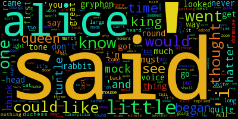
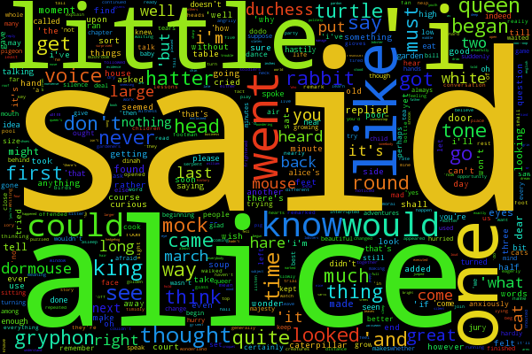
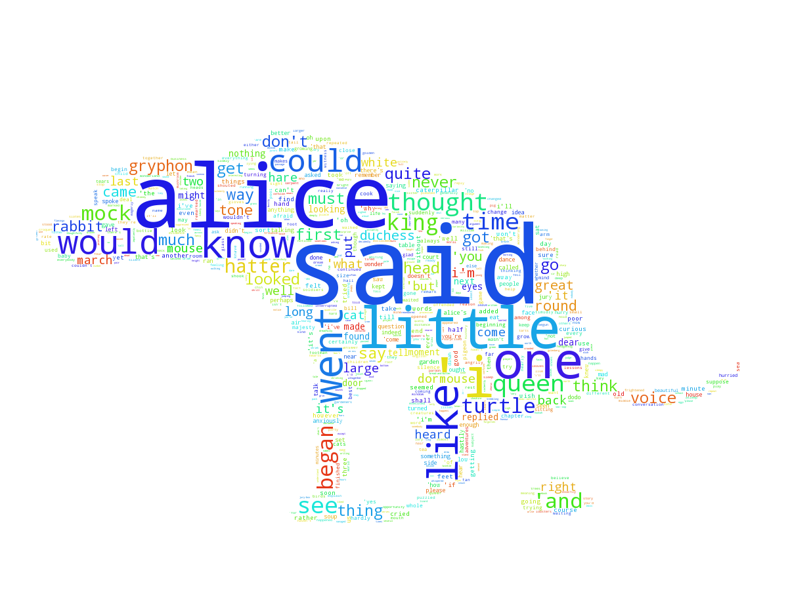
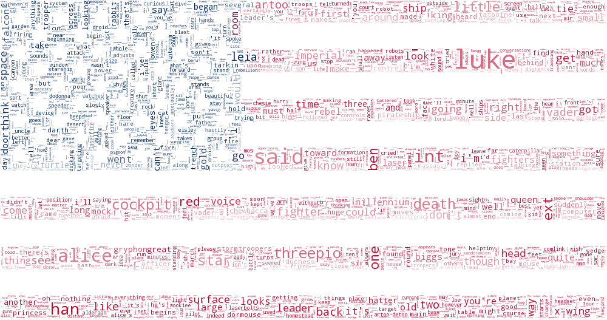

facebook-chat-word-cloud
========================
.. image:: https://travis-ci.org/mjmeli/facebook-chat-word-cloud.svg?branch=master
    :target: https://travis-ci.org/mjmeli/facebook-chat-word-cloud
A Python tool for generating a word cloud for a Facebook chat conversation.

Requirements
------------
This uses `lxml` to parse the messages file provided by Facebook. This requires `libxml2` and `libxslt` to be installed.

For Debian/Ubuntu:

    sudo apt-get install libxml2-dev libxslt-dev python-dev

This also uses `Pillow` to handle image manipulation. This requires `libjpeg`, `zlib`, and `libfreetype`:

    sudo apt-get install libjpeg-dev zlib1g-dev libfreetype6-dev

Installation
------------
    pip install .

Development
-----------
    pip install -e .

Testing
-------
    python setup.py test

Quick Example Usage
-------------
Request your Facebook data archive and get the messages.htm file.

Generate default word cloud:

    facebook_wordcloud examples/messages_sample.htm "Foo Bar"

Use a configuration file for customization:

    facebook_wordcloud examples/messages_sample.htm "Foo Bar" -c config.json

Use the sample conversation file for quick testing:

    facebook_wordcloud examples/messages_sample.htm "Foo Bar" -sample

Output the word cloud to an image

    facebook_wordcloud examples/messages_sample.htm "Foo Bar" -o output.png

Detailed Usage Usage
-----
This is essentially a command line wrapper around the `Andreas Muller's <https://github.com/amueller>`_  `word_cloud Python library<https://github.com/amueller/word_cloud>`_. This simply parses Facebook messages and passes data to that library.

First step is to get your Facebook messages archive:

1. Go to Facebook Settings: https://www.facebook.com/settings
2. Click the link at the bottom ("Download a copy of your Facebook data")
3. Click "Start My Archive" and wait for the download to be ready
4. Download and extract
5. Pull out or remember the location of the **messages.htm** file

The script is easy to use:

    facebook_wordcloud [messages_file] [users] {optional arguments}

Where,

- [message_file] is the relative path of your **messages.html** file
- [users] is a comma separated list of the users involved in the conversation (i.e., if you want the conversation with your friend John Smith, [users] should be "John Smith"). You can specify multiple people for group conversations (i.e. "John Smith, Bob Bobby")

There are a few important optional arguments:

- the "-c" or "--config-file" arguments allow you to specify a json configuration file. There is an example of one in the root of this directory (**config.json**), and some more examples in the examples/ folder. **I highly recommend using such a file if you want non-default settings**!
- the "-o" or "--out" option allows you to specify where you want the image to output to
- the "-sample" or "--sample" option allows you to use an internal sample conversation (same as in examples/messages_sample.htm). **Your messages file will likely be large and will take a long time to parse, so when you are customizing, you may find this option helpful.**
- the "-h" or "--help" option shows help

There are many more arguments that mainly allow you to change the configuration of the word cloud. However, *all of these arguments can be specified in the json configuration file*. It will be much easier to use a config file! If you are stubborn, use the "-h" or "--help" option to see all the arguments.

**IMPORTANT: Command line arguments override config files!**

Helpful Hints
-------------
The messages file downloaded from Facebook will probably be quite large (mine was 60 MB). It may take a while to parse, which can get annoying when you are making small changes to get a nice looking word cloud. I highly recommend using the sample conversation I provide as this will parse in seconds and has very high word density. You can either directly reference this file (examples/messages_sample.htm with user "Foo Bar") or just use the "-sample" option with the command

Examples
--------
See the **examples** directory for some great examples of what you can do and some more description on the topic of customization.

Releasing
---------
https://python-packaging.readthedocs.io/en/latest/minimal.html

Parser Choice
-------------
I originally used BeautifulSoup and then switched to the lxml parser. This is slightly annoying because it requires system libraries, but the performance is significantly better. See the benchmarks below from attempting to analyze a 60 MB file:

+---------------+-------------------------+-------------------+
| Parser        | Build Tree Runtime (ms) | Max Memory Usage  |
+===============+=========================+===================+
| BeautifulSoup | 90750                   | 3450 MB (3.45 GB) |
+---------------+-------------------------+-------------------+
| lxml          | 1945                    | 910 MB (0.91 GB)  |
+---------------+-------------------------+-------------------+

Issues
------
**ImportError: The _imagingft C module is not installed**
This means you don't have `libfreetype` installed. See the Requirements section. If installing it does not work, you may have to uninstall and reinstall `Pillow` via `pip`.

**IOError: Couldn't locate mask file...did you make sure to specify the URL relative to where you are running the script?**
This error is self-explanatory. In `masked/config.json`, the mask file is specified with a relative URL. This URL is *relative to where you are running the script*. I wrote the config file assuming that you were running the `facebook_wordcloud` in the `/examples` directory. If this is not the case, then either `cd` into that directory, or adjust the path in `masked/config.json`.

**The mask doesn't seem to be working?**
I ran into this issue a few times. Make sure the mask is either in RGB or grayscale. Note that only parts that are pure white (#FFFFFF) will be removed.
